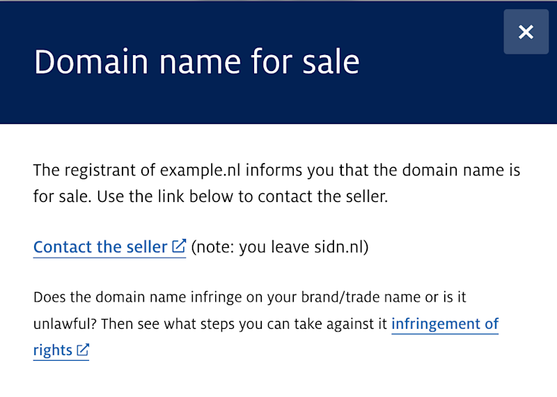

# 🫱🏽‍🫲🏼 The SIDN case

SIDN (registry for .nl ccTLD) implemented the ForSale mechanism that later became RFC10023 in close cooperation with participating .nl registrars.

Instead of storing a full sales URL in every DNS record, each registrar registers a single landing page with SIDN. SIDN assigns that landing page a unique identifier, which registrars publish in the `fcod` field of the _for-sale TXT record whenever a customer marks a domain name as being for sale, like this:

```
_for-sale TXT "v=FORSALE1;fcod=NLFS-NGYyYjEyZWYtZTUzYi00M2U0LTliNmYtNTcxZjBhMzA2NWQy"
```

When a user looks up a domain name in the [SIDN WHOIS](https://whois.nl) service, SIDN checks for the presence of a `_for-sale` TXT record. If an fcod identifier is found, SIDN resolves it to the registrar's registered landing page and displays a "For Sale" button that directs prospective buyers to the appropriate sales page for that domain. 

This SIDN-specific implementation keeps DNS records compact, allows registrars to change their landing page without updating every DNS record, and enables SIDN to validate the registered destination URLs, reducing the risk of malicious redirects.



